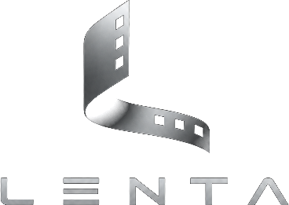
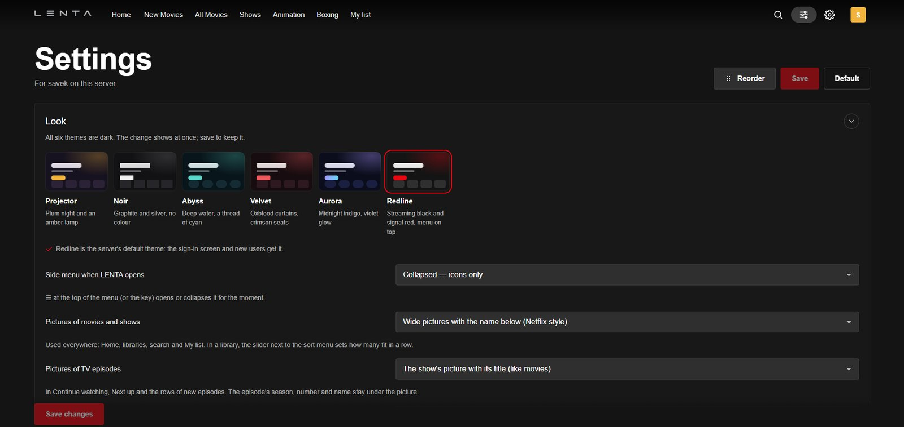
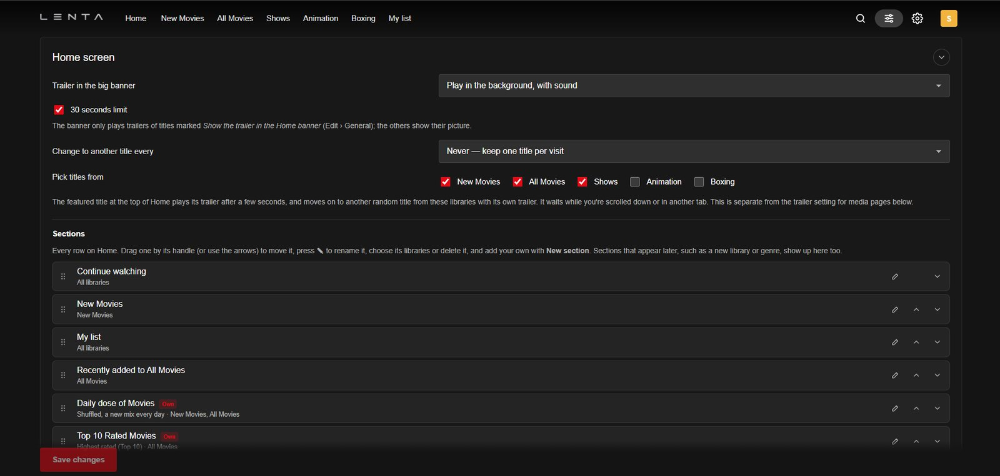
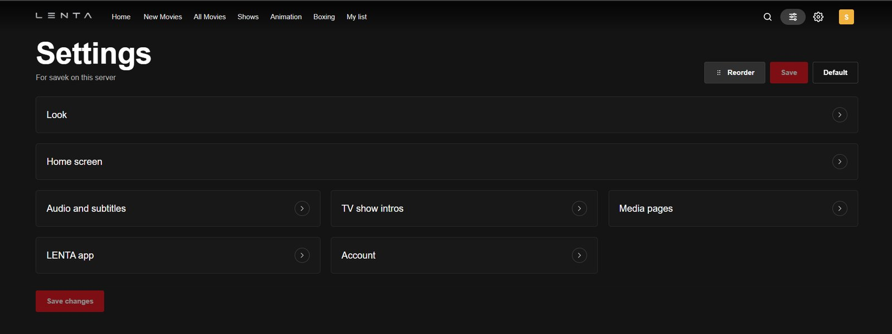
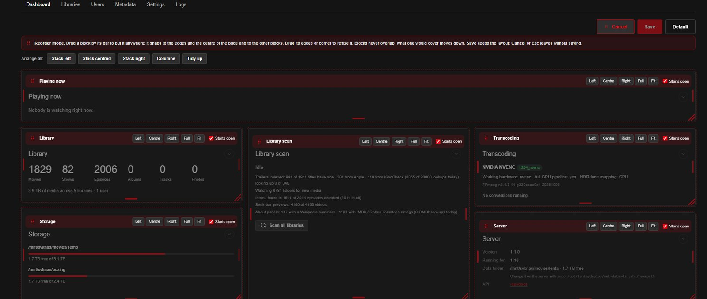
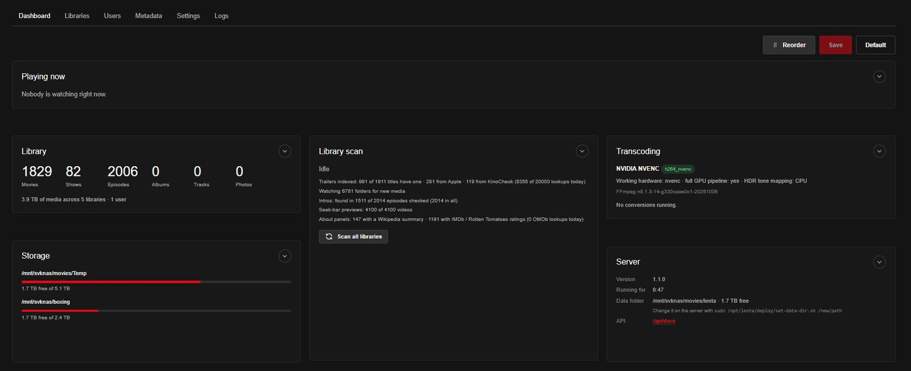
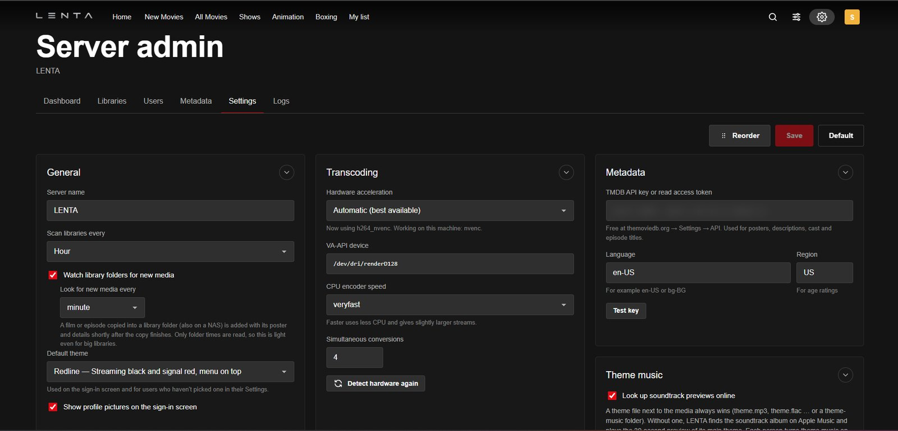

<p align="center">
  
</p>

<p align="center">
  <b>Your own streaming service at home.</b><br>
  A free, self-hosted media server and web player for your movies, TV shows, music and photos.
</p>

<p align="center">
  
  
  
  
  
</p>

<p align="center">
  <a href="docs/INSTALL.md"><b>Install guide</b></a> ·
  <a href="docs/USER-GUIDE.md"><b>User guide</b></a> ·
  <a href="docs/INSTALL.md#troubleshooting"><b>Troubleshooting</b></a> ·
  <a href="docs/INSTALL.md#faq"><b>FAQ</b></a>
</p>

---
I wanted a media organizer which gives me more than Plex and Jellyfin do. This project is and probably going to be forever work-in-progress. 
I am working on an Android app and support for Samsung TV's after 2017 onwards. You would see this in the source - you can try and use them but they are not stable at all (maybe the Android app is bit better). 
I am doing this just for the fun of it - I am in no way a professional. This project is completely FREE to everyone. Do whatever you like with it. 

LENTA runs on one Linux machine in your home, reads your media folders, finds posters, descriptions,
cast and trailers, and streams everything to any browser, phone or tablet on your network. When a device
can't play a file as it is, LENTA converts it on the fly, on your graphics card if you have one.

No accounts, no subscriptions, no cloud, no tracking. Your media stays on your disks.

<p align="center"><a href="#-screenshots"><b>Screenshots ↓</b></a></p>

## 📸 Screenshots

<table>
  <tr>
    <td width="50%"><br><b>Six themes.</b> Each person picks their own; the administrator sets the one the sign-in screen uses.</td>
    <td width="50%"><br><b>Your Home, your way.</b> Rename, reorder, delete or create Home rows and choose which libraries fill each one.</td>
  </tr>
  <tr>
    <td><br><b>Tidy settings.</b> Every block folds to its title, and you choose which ones start open.</td>
    <td><br><b>Reorder mode.</b> Drag, resize and arrange the blocks of Settings and the admin pages any way you like.</td>
  </tr>
  <tr>
    <td><br><b>Server dashboard.</b> What's playing, library size, scans, the graphics card in use and free disk space.</td>
    <td><br><b>Server settings.</b> Scanning, hardware conversion, metadata, artwork, trailers and subtitles.</td>
  </tr>
</table>

<sub>Screenshots of the Home screen are left out on purpose: they would show film posters and stills, which belong
to the studios. Only LENTA's own screens are shown here.</sub>

## ✨ Features

**Watching**
- 🎬 Netflix-style home with a featured banner and rows: *Continue watching*, *Next up*, *Recently added*, *My list*
- ▶️ Hover previews that play the trailer and carry on to the exact frame on the title page
- 🖥️ A full player: seek anywhere, audio and subtitle tracks, quality, next-episode autoplay, keyboard shortcuts
- 🎵 Music with a player bar that keeps going while you browse; photo albums with a swipeable viewer
- 🎨 Six dark themes (one with a streaming-style menu bar on top), poster or landscape artwork, grid, detail and table views

**Your library, done for you**
- 🔍 Understands real-world file names, release names, collection folders and the Plex/Jellyfin layout
- 🖼️ Artwork from your own files, embedded covers, TMDB, Fanart.tv, OMDb and AniList, in the order you choose
- ⭐ TMDB and IMDb ratings, plus Rotten Tomatoes and Metacritic with an OMDb key
- 📖 About panel: director, writers, music, budget, box office, Wikipedia summary, other films in the collection
- 🎞️ Trailers from your own files, Apple TV, KinoCheck's official picks or YouTube, and theme music
- 💬 Subtitles: embedded, next to the file, or downloaded from OpenSubtitles automatically
- ✏️ Edit any title by hand; locked fields survive every refresh

**Streaming that just works**
- ⚡ Direct play when the device can, light repackaging when it nearly can, full conversion when it must
- 🚀 Hardware conversion on NVIDIA (NVENC), Intel Quick Sync and AMD/Intel VA-API, with HDR tone mapping
- 📱 Phone and tablet layouts, an installable web app, a small **Android app (APK)** and a **Samsung TV app** with remote-control navigation
- 👨‍👩‍👧 Several users, each with their own watch history, *My list* and library access

**Easy to run**
- 🐧 One command to install on Ubuntu, one command to update
- 🔒 Runs as its own unprivileged account; your media is only ever read
- 🧰 **Never installs or touches graphics drivers**: it uses the ones you have
- 📂 You choose where its data lives, and can move it later with one command

## 🚀 Quick start

On Ubuntu 24.04 or 26.04 (64-bit x86):

```bash
git clone https://github.com/vladsavekovv/lenta.git
cd lenta
sudo ./deploy/install.sh
```

Then:

1. Let LENTA read your media: `sudo setfacl -R -m u:lenta:rX -m d:u:lenta:rX /path/to/media`
2. Open `http://<server-address>:8484` and create the administrator account.
3. Paste a free [TMDB API key](https://www.themoviedb.org/settings/api) in **Server admin › Settings**.
4. Add your libraries in **Server admin › Libraries**.

**👉 New to this? Follow the [step-by-step install guide](docs/INSTALL.md).** It covers requirements,
permissions, NAS shares, graphics cards, phones, remote access, updates, backups and troubleshooting.

## 📚 Documentation

| Guide | What's in it |
|---|---|
| [**Install guide**](docs/INSTALL.md) | Requirements, installation, first setup, GPU, NAS, remote access, updating, backups, uninstalling, troubleshooting, FAQ |
| [**User guide**](docs/USER-GUIDE.md) | Naming your files, libraries, the apps, themes, subtitles, trailers, metadata and artwork, users, shortcuts, API |
| [**Samsung TV**](docs/SAMSUNG-TV.md) | !! WORK IN PROGRESS !! Watching on a Samsung TV: the TV's browser, or the LENTA TV app installed from your server |
| [**Contributing**](CONTRIBUTING.md) | Running from source, project layout, rebuilding the Android app (WORK IN PROGRESS), sending changes |
| [**Third-party notices**](THIRD-PARTY-NOTICES.md) | The open-source pieces and data services LENTA uses |

## 🧩 How it fits together

```
 [ Your files ] ──► ( LENTA Media Server ) ◄── home network / VPN ──► [ LENTA in a browser ]
   local disks        Python · SQLite · FFmpeg                          computer · phone · tablet · TV
   NAS shares         port 8484                                         or the LENTA Android app
```

- **Server** (`server/`): Python (FastAPI) with an SQLite database. Scans folders, fetches metadata,
  decides how each file is played and runs FFmpeg when it has to convert.
- **Web client** (`web/`): plain HTML, CSS and JavaScript, nothing to build. Fonts and the video library
  are bundled, so it works without internet.
- **Android app** (`android/`): a small full-screen app that opens your LENTA server.

## ❓ Questions

- **Is it free?** Yes, completely, for everyone. It is in the public domain. See [License](#-license).
- **Does it need internet?** Only for installing and for metadata, trailers and subtitle downloads.
  Playback at home works offline.
- **Does it replace Plex or Jellyfin?** It does the same job and can run next to them on the same media.

More in the [FAQ](docs/INSTALL.md#faq).

## 🤝 Contributing

Bug reports, ideas and pull requests are welcome. Please read [CONTRIBUTING.md](CONTRIBUTING.md) first,
and use the issue templates so we get the details needed to help.

## 📜 License

LENTA is free and unencumbered software released into the **public domain** under [the Unlicense](LICENSE).
Anyone may use, copy, change, share or build on it, for any purpose, without asking and without paying.
No copyright is claimed on LENTA's own code, artwork or documentation.
Bundled and downloaded third-party components keep their own licenses, listed in
[THIRD-PARTY-NOTICES.md](THIRD-PARTY-NOTICES.md).

This product uses the TMDB API but is not endorsed or certified by TMDB. IMDb ratings come from the
[IMDb Non-Commercial Datasets](https://developer.imdb.com/non-commercial-datasets/), which IMDb allows for
personal, non-commercial use only: anyone using LENTA otherwise should switch IMDb ratings off (Server admin ›
Settings › About panel extras). The same goes for each online service: its data stays under its own terms. LENTA is not affiliated with Netflix, Plex, Jellyfin, IMDb, TMDB, Apple or any of
the services it can connect to. You are responsible for the media you add to it.
